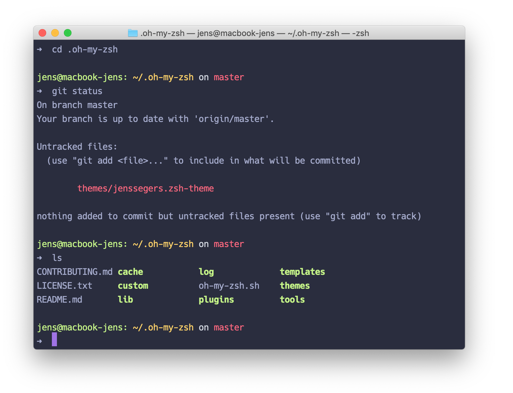

## My personal ZSH theme


## Installation

Requires you to have [oh-my-zsh](https://github.com/robbyrussell/oh-my-zsh) installed.

### Manual

```bash
wget -O ~/.oh-my-zsh/themes/jenssegers.zsh-theme
https://raw.githubusercontent.com/jenssegers/zsh/master/jenssegers.zsh-theme
```

Then go to your `~/.zshrc` file and set `ZSH_THEME="jenssegers"`

### Zplug

```
zplug "jenssegers/zsh", as:theme
```

### Antigen

```
antigen theme jenssegers/zsh jenssegers
```

## Configuration

There's an environment variable you can set to display your host. Simply add this to your `.zshrc`:

```bash
export ZSH_THEME_SHOW_HOST=true
```


